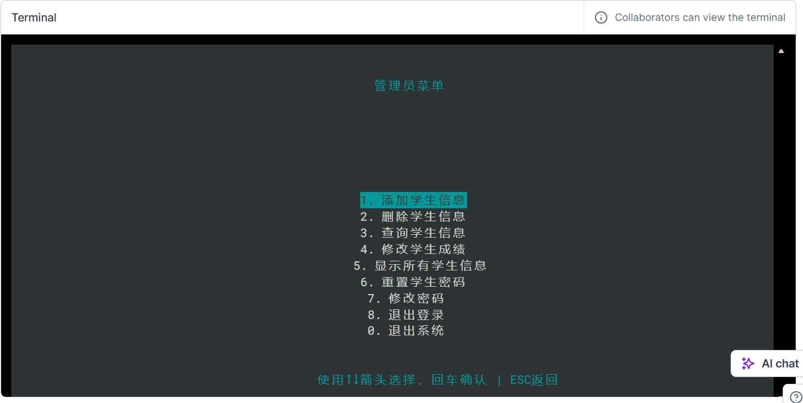
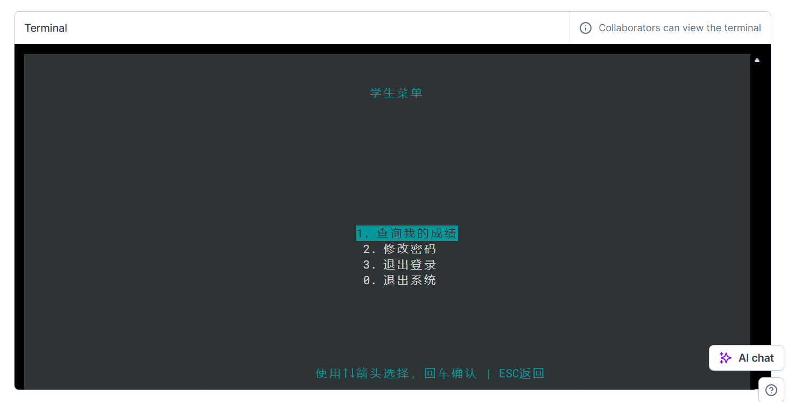
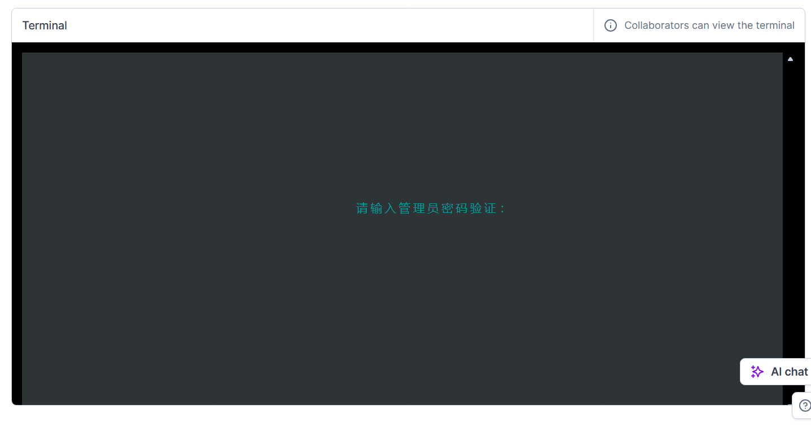

# StudentManager / 学生成绩管理系统
<h4 align="right"><a href="README_EN.md">English</a> | <strong>简体中文</strong>

## 1. 前言
本项目有我使用Deepseek.com，可能有些不足，如果遇到BUG或有想要的功能可提交IUSSES或PR。本项目仅在Docker镜像`deepnote/python:3.9`下测试，其他平台我暂时没有测试，提交PR时请在此镜像测试好，感谢。此代码无任何限制，可随意拿取，但别忘了给一个STAR
## 2. 使用方法
### 注意，使用二进制版不可以使用Ctrl + C直接退出，否则会引发控制台不能输入BUG，如遇到，请重启终端！
### 1. 默认信息
1. 默认学生账号`学号`，默认学生密码：`s123456`
2. 默认管理员账号`admin`默认管理员密码：`123456`
3. 默认退出密码：`同管理员密码`
---
请务必更改管理员密码
### 2. 运行方式（需将`main`改为实际文件名）
#### 1. 源代码方式
1. 切换命令行工作目录至源代码存储路径
2. 输入命令`python main.py`
#### 2. 二进制方式
1. 切换命令行工作目录至二进制文件存储路径
2. 输入命令`./main`
---
### 3. 权限
1. 管理员

2. 学生

### 4. 文件存储
#### 1. 文件存储格式位置
存储在当前位置的`data.json`
#### 2. 存储格式
示例
```json
{
  "students": {
    "001": {
      "name": "zhangsan",
      "chinese": 100.0,
      "math": 100.0,
      "english": 100.0,
      "total": 300.0,
      "average": 100.0
    }
  },
  "accounts": {
    "admin": {
      "password": "e10adc3949ba59abbe56e057f20f883e",
      "role": "admin"
    },
    "001": {
      "password": "e13f3643cc57e9c43577229842080912",
      "role": "student"
    }
  }
}
```
```
"name": "姓名",
"chinese": 语文成绩,
"math": 数学成绩,
"english": 英语成绩,
"total": 总分,
"average": 平均分,
"password":使用MD5加密的密码,
"rolr":权限，admin为管理员，student为学生
```
### 5. 退出系统
管理员退出系统时因可能会做更改，所以管理员退出系统时需确认密码。

## 3. 支持
1. 如果您对此项目感兴趣，欢迎给我一个star
2. 如果您想支持本项目，欢迎提交ISSUES或PR